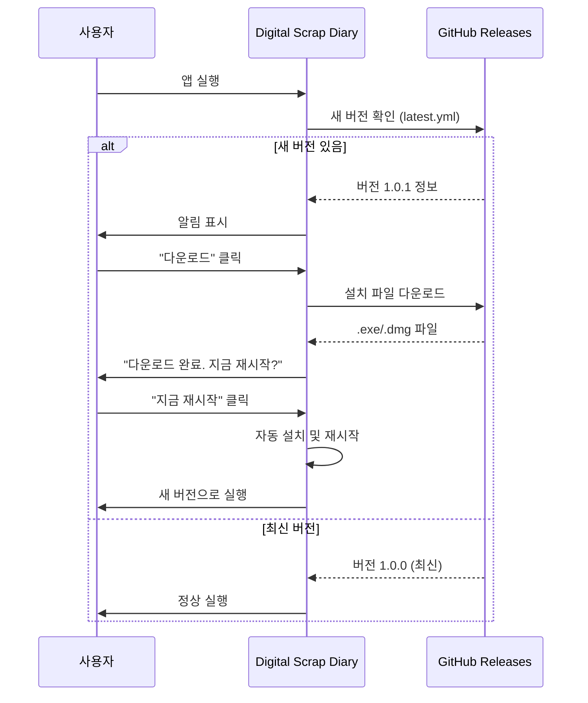

# 🔄 자동 업데이트 배포 가이드

**Digital Scrap Diary - Electron 자동 업데이트**

이 가이드는 electron-updater를 사용하여 자동 업데이트 기능을 구현하고 배포하는 방법을 설명합니다.

---

## 📋 목차

1. [개요](#개요)
2. [설정 확인](#설정-확인)
3. [GitHub 저장소 설정](#github-저장소-설정)
4. [배포 프로세스](#배포-프로세스)
5. [사용자 경험](#사용자-경험)
6. [트러블슈팅](#트러블슈팅)

---

## 개요

### 자동 업데이트 작동 방식



### 구현된 기능

- ✅ **자동 업데이트 확인**: 앱 시작 5초 후 자동으로 새 버전 확인
- ✅ **백그라운드 다운로드**: 사용자가 앱을 사용하는 동안 백그라운드에서 다운로드
- ✅ **진행률 표시**: 다운로드 진행률을 실시간으로 표시
- ✅ **사용자 알림**: 새 버전이 준비되면 알림 표시
- ✅ **원클릭 설치**: "지금 재시작" 버튼으로 즉시 업데이트
- ✅ **델타 업데이트 (Windows)**: 변경된 부분만 다운로드하여 데이터 절약

---

## 설정 확인

### 1. 패키지 설치 확인

`package.json`에 다음 패키지가 있는지 확인:

```json
{
  "dependencies": {
    "electron-updater": "^6.7.3"
  },
  "devDependencies": {
    "electron": "^28.3.3",
    "electron-builder": "^24.13.3"
  }
}
```

### 2. electron-builder.json 설정

```json
{
  "appId": "com.digitalscrapdiary.app",
  "publish": [
    {
      "provider": "github",
      "owner": "yourusername",        // ⚠️ 실제 GitHub 사용자명으로 변경
      "repo": "digitalscrapdiary",    // ⚠️ 실제 저장소명으로 변경
      "releaseType": "release"
    }
  ]
}
```

### 3. package.json 메타데이터

```json
{
  "name": "digitalscrapdiary",
  "version": "1.0.0",                // ⚠️ 버전 관리 중요!
  "repository": {
    "type": "git",
    "url": "https://github.com/yourusername/digitalscrapdiary.git"  // ⚠️ 변경 필수
  }
}
```

---

## GitHub 저장소 설정

### 1. 저장소 생성

1. GitHub에서 새 저장소 생성:
   - 저장소명: `digitalscrapdiary` (또는 원하는 이름)
   - Public 또는 Private (자동 업데이트는 둘 다 작동)

2. 로컬 코드를 GitHub에 푸시:

```bash
cd c:\work\digitalscrapdiary-2

# Git 초기화 (아직 안 했다면)
git init

# 원격 저장소 추가
git remote add origin https://github.com/yourusername/digitalscrapdiary.git

# 브랜치 생성 및 코드 푸시
git branch -M main
git add .
git commit -m "feat: Initial commit with auto-update support"
git push -u origin main
```

### 2. package.json 및 electron-builder.json 수정

실제 GitHub 정보로 수정:

**package.json:**
```json
{
  "repository": {
    "url": "https://github.com/실제사용자명/digitalscrapdiary.git"
  }
}
```

**electron-builder.json:**
```json
{
  "publish": [
    {
      "provider": "github",
      "owner": "실제사용자명",
      "repo": "digitalscrapdiary"
    }
  ]
}
```

수정 후 다시 커밋:

```bash
git add package.json electron-builder.json
git commit -m "chore: Update GitHub repository info"
git push
```

---

## 배포 프로세스

### 첫 릴리스 (v1.0.0)

1. **버전 확인**

```bash
# 현재 버전 확인
grep '"version"' package.json
```

2. **Git 태그 생성 및 푸시**

```bash
# 태그 생성
git tag v1.0.0

# 태그 푸시
git push origin v1.0.0
```

3. **GitHub Actions 확인**

- GitHub 저장소 → **Actions** 탭
- "Release Desktop App" 워크플로우 실행 확인
- 약 10-20분 소요 (3개 플랫폼 빌드)

4. **릴리스 확인**

- GitHub 저장소 → **Releases** 탭
- v1.0.0 릴리스가 생성되었는지 확인
- 다음 파일들이 업로드되었는지 확인:
  - Windows: `Digital Scrap Diary Setup 1.0.0.exe`, `latest.yml`
  - macOS: `Digital Scrap Diary-1.0.0-arm64.dmg`, `latest-mac.yml`
  - Linux: `Digital-Scrap-Diary-1.0.0.AppImage`

### 업데이트 릴리스 (v1.0.1, v1.0.2, ...)

1. **코드 변경**

```bash
# 기능 추가/버그 수정
git add .
git commit -m "fix: Bug fix or feature addition"
git push
```

2. **버전 업데이트**

```bash
# 패치 버전 증가 (1.0.0 → 1.0.1)
npm version patch

# 또는 마이너 버전 증가 (1.0.0 → 1.1.0)
npm version minor

# 또는 메이저 버전 증가 (1.0.0 → 2.0.0)
npm version major
```

`npm version` 명령은 자동으로:
- `package.json`의 버전 업데이트
- Git 태그 생성 (v1.0.1)
- Git 커밋 생성

3. **푸시**

```bash
# 코드와 태그를 함께 푸시
git push --follow-tags
```

4. **GitHub Actions 자동 빌드**

- GitHub Actions가 자동으로 빌드 시작
- 약 10-20분 후 새 릴리스 생성

5. **사용자 업데이트**

- 사용자가 앱을 실행하면 자동으로 새 버전 감지
- 알림 표시 → 다운로드 → 재시작 → 업데이트 완료

---

## 사용자 경험

### 업데이트 알림

사용자가 앱을 실행하면 다음과 같은 알림이 표시됩니다:

1. **새 버전 발견**
   ```
   🎉 새 버전 1.0.1이 있습니다!
   
   [다운로드]  [나중에]
   ```

2. **다운로드 중**
   ```
   ⬇️ 업데이트 다운로드 중...
   
   ████████░░░░░░░░░░ 45.2%
   (27.3 MB / 60.5 MB)
   ```

3. **다운로드 완료**
   ```
   ✅ 업데이트 준비 완료!
   
   버전 1.0.1이 다운로드되었습니다.
   지금 재시작하시겠습니까?
   
   [지금 재시작]  [나중에]
   ```

4. **재시작 후**
   - 자동으로 설치
   - 새 버전으로 실행

---

## 트러블슈팅

### 문제 1: "업데이트 확인 실패"

**원인:**
- GitHub 저장소 정보가 올바르지 않음
- 네트워크 연결 문제
- GitHub Releases가 생성되지 않음

**해결:**
1. `package.json`과 `electron-builder.json`의 GitHub 정보 확인
2. GitHub → Releases 탭에서 릴리스가 있는지 확인
3. 개발자 도구(F12) → Console에서 에러 메시지 확인

### 문제 2: "다운로드가 시작되지 않음"

**원인:**
- `latest.yml` 또는 `latest-mac.yml` 파일이 없음
- 설치 파일이 업로드되지 않음

**해결:**
1. GitHub Releases에서 다음 파일 확인:
   - Windows: `latest.yml`
   - macOS: `latest-mac.yml`
2. GitHub Actions 로그에서 빌드 에러 확인

### 문제 3: "개발 모드에서 업데이트 확인"

**설명:**
- 개발 모드(`npm run dev`)에서는 자동 업데이트가 비활성화됩니다.
- 이는 의도된 동작입니다.

**테스트 방법:**
1. 프로덕션 빌드 생성:
   ```bash
   npm run electron:build:win
   ```
2. `release/` 폴더의 설치 파일 실행
3. 설치 후 앱 실행하여 업데이트 확인

### 문제 4: "버전이 증가했는데 업데이트가 감지되지 않음"

**원인:**
- 시맨틱 버저닝 규칙을 따르지 않음
- 태그를 푸시하지 않음

**해결:**
1. 버전 형식 확인: `1.0.0`, `1.0.1`, `1.1.0` (올바름)
2. `v` 접두사 확인: `v1.0.0` (올바름), `1.0.0` (태그에는 v 필요)
3. 태그가 푸시되었는지 확인:
   ```bash
   git tag
   git push origin v1.0.1
   ```

### 문제 5: "Windows SmartScreen 경고"

**설명:**
- 코드 서명이 없는 앱은 Windows SmartScreen 경고가 표시됩니다.
- 자동 업데이트는 정상 작동하지만 사용자 경험이 나쁠 수 있습니다.

**해결 (선택사항):**
1. Code Signing Certificate 구매 ($80-300/년)
2. `electron-builder.json`에 인증서 설정
3. 상세 내용은 `CODE_SIGNING_GUIDE.md` 참조

---

## 로컬 테스트

### 개발 모드 테스트

개발 모드에서는 자동 업데이트가 비활성화됩니다. 테스트하려면:

1. **v1.0.0 빌드 및 설치**

```bash
npm run electron:build:win
cd release
# Digital Scrap Diary Setup 1.0.0.exe 실행하여 설치
```

2. **코드 수정 및 v1.0.1 릴리스**

```bash
# 코드 수정
git add .
git commit -m "test: Update test"

# 버전 업
npm version patch

# 빌드 (GitHub에 푸시하지 않고 로컬 테스트)
npm run electron:build:win
```

3. **GitHub에 v1.0.1 릴리스 생성**

- 수동으로 GitHub Releases에 v1.0.1 생성
- `release/` 폴더의 파일들을 업로드

4. **설치된 v1.0.0 앱 실행**

- 자동으로 v1.0.1 감지
- 업데이트 다운로드 및 설치 테스트

---

## 참고 자료

### 공식 문서

- [electron-updater 문서](https://www.electron.build/auto-update)
- [electron-builder 문서](https://www.electron.build/)
- [GitHub Releases 가이드](https://docs.github.com/en/repositories/releasing-projects-on-github)

### 프로젝트 문서

- `DEPLOYMENT_GUIDE.md` - 일반 배포 가이드
- `CODE_SIGNING_GUIDE.md` - 코드 서명 가이드
- `FINAL_DEPLOYMENT_SUMMARY.md` - 배포 요약
- `.github/workflows/release.yml` - GitHub Actions 워크플로우

### 관련 파일

- `electron/main.ts` - 자동 업데이트 로직
- `electron/preload.ts` - IPC 채널 정의
- `components/UpdateNotification.tsx` - 업데이트 알림 UI
- `electron-builder.json` - 빌드 설정

---

## 요약

### 배포 체크리스트

- [ ] GitHub 저장소 생성
- [ ] `package.json`의 `repository.url` 수정
- [ ] `electron-builder.json`의 `owner`, `repo` 수정
- [ ] 코드를 GitHub에 푸시
- [ ] 첫 태그 생성 및 푸시 (`v1.0.0`)
- [ ] GitHub Actions 빌드 확인
- [ ] Releases에서 파일 확인 (`latest.yml`, `.exe`, `.dmg` 등)
- [ ] 로컬에서 설치 및 업데이트 테스트

### 업데이트 체크리스트

- [ ] 코드 변경 및 커밋
- [ ] `npm version patch/minor/major`
- [ ] `git push --follow-tags`
- [ ] GitHub Actions 자동 빌드 대기
- [ ] 사용자 앱에서 업데이트 확인 테스트

---

## 지원

문제가 발생하면:

1. GitHub Issues에 버그 리포트
2. GitHub Discussions에서 질문
3. 프로젝트 문서 참조

---

**작성일**: 2026-01-30  
**프로젝트**: Digital Scrap Diary v1.0.0  
**문서 버전**: 1.0

