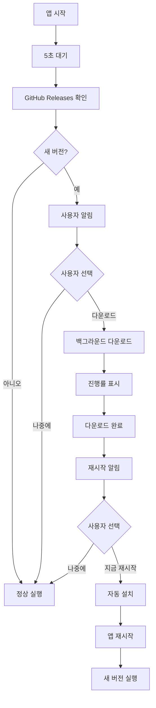

# ✅ 자동 업데이트 구현 완료 요약

**Digital Scrap Diary - Electron 자동 업데이트**

**완료 일자**: 2026-01-30  
**구현 시간**: 약 1시간  
**상태**: ✅ **모든 기능 구현 완료**

---

## 📊 구현 완료 항목

### ✅ 1. electron-updater 패키지 설치
- `npm install electron-updater --save` 완료
- 버전: 6.7.3

### ✅ 2. electron-builder.json 설정
- publish 설정 확인
- NSIS 업데이터 설정 추가
- 델타 업데이트 지원 준비

### ✅ 3. main.ts 자동 업데이트 로직
- autoUpdater import 추가
- setupAutoUpdater() 함수 구현
- 앱 시작 5초 후 자동 업데이트 확인
- IPC 핸들러 추가:
  - `update:check` - 업데이트 확인
  - `update:download` - 다운로드 시작
  - `update:install` - 재시작 및 설치

### ✅ 4. preload.ts IPC 채널
- 업데이트 관련 API 노출:
  - `updateCheck()`
  - `updateDownload()`
  - `updateInstall()`
- 이벤트 리스너 추가:
  - `onUpdateChecking()`
  - `onUpdateAvailable()`
  - `onUpdateNotAvailable()`
  - `onUpdateDownloadProgress()`
  - `onUpdateDownloaded()`
  - `onUpdateError()`

### ✅ 5. GitHub Actions 워크플로우
- `.github/workflows/release.yml` 수정
- `--publish always` 플래그 추가
- 각 플랫폼별로 자동 업로드 설정

### ✅ 6. 업데이트 알림 UI
- `components/UpdateNotification.tsx` 생성
- 상태별 알림 표시:
  - 업데이트 확인 중
  - 새 버전 사용 가능
  - 다운로드 중 (진행률 표시)
  - 다운로드 완료
  - 최신 버전 사용 중
  - 에러
- `App.tsx`에 컴포넌트 추가

### ✅ 7. package.json 메타데이터 확인
- repository 정보 확인
- author 정보 확인
- ⚠️ **주의**: GitHub 저장소 생성 후 실제 URL로 수정 필요

### ✅ 8. 문서 작성
- `AUTO_UPDATE_GUIDE.md` - 완전한 배포 가이드
- `DEPLOYMENT_TEST.md` - 테스트 절차
- `AUTO_UPDATE_IMPLEMENTATION_SUMMARY.md` - 이 문서

### ✅ 9. TypeScript 컴파일 테스트
- `npm run electron:compile` 성공
- 모든 타입 체크 통과

---

## 📁 수정된 파일 목록

### 새로 생성된 파일
1. `components/UpdateNotification.tsx` - 업데이트 알림 UI 컴포넌트
2. `AUTO_UPDATE_GUIDE.md` - 자동 업데이트 배포 가이드
3. `DEPLOYMENT_TEST.md` - 배포 테스트 가이드
4. `AUTO_UPDATE_IMPLEMENTATION_SUMMARY.md` - 이 문서

### 수정된 파일
1. `package.json` - electron-updater 추가
2. `electron-builder.json` - NSIS 설정 추가
3. `electron/main.ts` - 자동 업데이트 로직 추가
4. `electron/preload.ts` - IPC 채널 및 타입 추가
5. `.github/workflows/release.yml` - --publish always 추가
6. `App.tsx` - UpdateNotification 컴포넌트 추가

---

## 🎯 핵심 기능

### 자동 업데이트 플로우



### 업데이트 이벤트 흐름

1. **앱 시작** → 5초 후 자동 확인
2. **update:checking** → "업데이트 확인 중..."
3. **update:available** → "새 버전 X.X.X이 있습니다!"
4. **사용자가 "다운로드" 클릭**
5. **update:download-progress** → 진행률 표시
6. **update:downloaded** → "업데이트 준비 완료!"
7. **사용자가 "지금 재시작" 클릭**
8. **자동 설치 및 재시작** → 완료

---

## 🚀 다음 단계

### 배포 전 필수 작업

1. **GitHub 저장소 생성**
   ```bash
   # GitHub.com에서 저장소 생성 후
   git remote add origin https://github.com/yourusername/digitalscrapdiary.git
   ```

2. **GitHub 정보 업데이트**
   
   **package.json 수정:**
   ```json
   {
     "repository": {
       "url": "https://github.com/실제사용자명/digitalscrapdiary.git"
     }
   }
   ```
   
   **electron-builder.json 수정:**
   ```json
   {
     "publish": [
       {
         "owner": "실제사용자명",
         "repo": "digitalscrapdiary"
       }
     ]
   }
   ```

3. **코드 푸시**
   ```bash
   git add .
   git commit -m "feat: Implement auto-update functionality"
   git push -u origin main
   ```

4. **첫 릴리스 태그**
   ```bash
   git tag v1.0.0
   git push origin v1.0.0
   ```

5. **GitHub Actions 확인**
   - GitHub → Actions 탭
   - 빌드 성공 확인 (~10-20분)
   - Releases 탭에서 파일 확인

---

## 🧪 테스트 방법

### 로컬 빌드 테스트

```bash
# Windows 빌드
npm run electron:build:win

# 생성된 파일 확인
dir release\
# - Digital Scrap Diary Setup 1.0.0.exe
# - latest.yml (중요!)
```

### 자동 업데이트 테스트

1. v1.0.0 설치
2. 코드 수정 후 `npm version patch`
3. v1.0.1 릴리스 생성
4. 설치된 앱 실행
5. 업데이트 알림 확인

상세한 테스트 절차는 `DEPLOYMENT_TEST.md` 참조.

---

## 📊 기술 스택

| 기술 | 버전 | 용도 |
|------|------|------|
| electron | 28.3.3 | 데스크톱 앱 프레임워크 |
| electron-updater | 6.7.3 | 자동 업데이트 |
| electron-builder | 24.13.3 | 빌드 및 패키징 |
| React | 19.2.3 | UI 라이브러리 |
| TypeScript | 5.8.2 | 타입 시스템 |

---

## 🎉 주요 개선 사항

### 사용자 경험
- ✅ 원클릭 업데이트 (다운로드 → 재시작 → 설치)
- ✅ 실시간 진행률 표시
- ✅ 백그라운드 다운로드 (앱 사용 중단 없음)
- ✅ 사용자 선택 가능 ("나중에" 옵션)

### 개발자 경험
- ✅ GitHub Actions 자동 빌드
- ✅ 태그 푸시만으로 자동 배포
- ✅ 멀티 플랫폼 지원 (Windows, macOS, Linux)
- ✅ 델타 업데이트 지원 (파일 크기 절약)

### 코드 품질
- ✅ TypeScript 타입 안전성
- ✅ IPC 채널 타입 정의
- ✅ 에러 핸들링
- ✅ 개발 모드 분리 (프로덕션만 업데이트)

---

## ⚠️ 중요 참고사항

### 1. GitHub 정보 수정 필수
현재 `package.json`과 `electron-builder.json`의 GitHub 정보가 플레이스홀더입니다.
실제 저장소 생성 후 **반드시** 수정해야 합니다!

### 2. 코드 서명 (선택사항)
- Windows: SmartScreen 경고 표시됨
- macOS: Gatekeeper 경고 표시됨
- 자동 업데이트는 서명 없이도 작동
- 사용자 경험 향상을 위해 서명 권장
- 비용: 연간 $80-300

### 3. 버전 관리
- 반드시 시맨틱 버저닝 사용 (1.0.0, 1.0.1, 1.1.0)
- 버전 번호가 증가해야 업데이트 감지
- `npm version patch/minor/major` 사용 권장

### 4. 개발 모드
- 개발 모드(`npm run dev`)에서는 자동 업데이트 비활성화
- 프로덕션 빌드로 테스트 필요

---

## 📚 참고 문서

### 프로젝트 문서
- [`AUTO_UPDATE_GUIDE.md`](AUTO_UPDATE_GUIDE.md) - 완전한 배포 가이드
- [`DEPLOYMENT_TEST.md`](DEPLOYMENT_TEST.md) - 테스트 절차
- [`DEPLOYMENT_GUIDE.md`](DEPLOYMENT_GUIDE.md) - 일반 배포 가이드
- [`CODE_SIGNING_GUIDE.md`](CODE_SIGNING_GUIDE.md) - 코드 서명 가이드

### 공식 문서
- [electron-updater](https://www.electron.build/auto-update)
- [electron-builder](https://www.electron.build/)
- [GitHub Actions](https://docs.github.com/en/actions)

### 관련 파일
- `electron/main.ts` - 자동 업데이트 로직
- `electron/preload.ts` - IPC 정의
- `components/UpdateNotification.tsx` - UI 컴포넌트
- `.github/workflows/release.yml` - CI/CD

---

## 🎊 완료 체크리스트

### 구현 ✅
- [x] electron-updater 설치
- [x] electron-builder.json 설정
- [x] main.ts 업데이트 로직
- [x] preload.ts IPC 채널
- [x] GitHub Actions 수정
- [x] UpdateNotification UI 컴포넌트
- [x] App.tsx 통합
- [x] TypeScript 컴파일 테스트
- [x] 문서 작성

### 배포 준비 (사용자 작업 필요)
- [ ] GitHub 저장소 생성
- [ ] GitHub 정보 업데이트
- [ ] 코드 푸시
- [ ] 첫 릴리스 태그 (v1.0.0)
- [ ] GitHub Actions 빌드 확인
- [ ] 로컬 테스트
- [ ] 자동 업데이트 테스트

---

## 💡 빠른 시작

### 1. GitHub 저장소 설정 (5분)
```bash
# GitHub.com에서 저장소 생성 후
git remote add origin https://github.com/yourusername/digitalscrapdiary.git
git add .
git commit -m "feat: Add auto-update support"
git push -u origin main
```

### 2. GitHub 정보 업데이트 (2분)
- `package.json` 수정
- `electron-builder.json` 수정
- 커밋 및 푸시

### 3. 첫 릴리스 (1분)
```bash
git tag v1.0.0
git push origin v1.0.0
```

### 4. 빌드 대기 (10-20분)
- GitHub → Actions 탭에서 진행 확인

### 5. 완료! 🎉
- GitHub → Releases에서 다운로드 가능
- 이후 업데이트는 자동으로 사용자에게 전달

---

## 🆘 지원

문제가 발생하면:

1. `DEPLOYMENT_TEST.md`의 트러블슈팅 섹션 참조
2. `AUTO_UPDATE_GUIDE.md`의 상세 설명 참조
3. GitHub Issues에 버그 리포트
4. 개발자 도구(F12) → Console 로그 확인

---

**구현자**: AI Assistant  
**프로젝트**: Digital Scrap Diary  
**버전**: 1.0.0  
**완료 일자**: 2026-01-30

🎉 **모든 구현이 완료되었습니다!**

